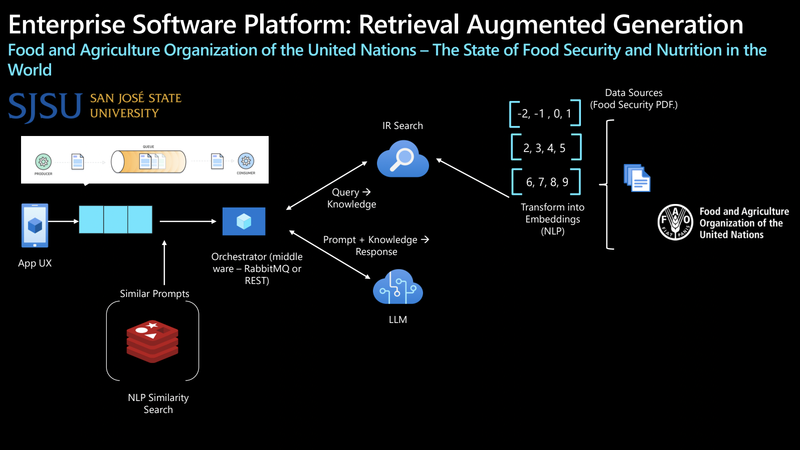

# CMPE273-Hackathon: AI-Powered Document Q&A System

A sophisticated Retrieval-Augmented Generation (RAG) system that provides intelligent question-answering capabilities for PDF documents. Built with modern AI/ML technologies, this system combines semantic search, document retrieval, and natural language generation to deliver accurate and contextual responses.

## 🚀 Features

- **Intelligent Document Processing**: Automatically extracts and processes PDF documents
- **Semantic Search**: Advanced vector-based document retrieval using FAISS
- **AI-Powered Q&A**: Leverages transformer models for accurate answer generation
- **Real-time Chat Interface**: Modern React-based chat UI with typing indicators
- **Redis Caching**: Efficient storage and retrieval of embeddings and document data
- **Text Beautification**: GPT-2 powered text refinement for better readability

## 🏗️ System Architecture

  
*High-level system architecture showing core components and data flow.*

This project implements a sophisticated RAG (Retrieval-Augmented Generation) pipeline:

1. **Document Ingestion**: PDF documents are processed and segmented into manageable chunks
2. **Embedding Generation**: Text segments are converted to high-dimensional vectors using sentence transformers
3. **Vector Indexing**: FAISS index enables fast similarity search across document embeddings
4. **Query Processing**: User queries are embedded and matched against document vectors
5. **Answer Generation**: Relevant document sections are used as context for answer generation
6. **Response Enhancement**: Generated answers are refined using text generation models

## 🛠️ Tech Stack

### Backend

- **Framework**: Flask 3.0.3
- **AI/ML Libraries**:
  - `sentence-transformers` (3.2.1) - For generating document embeddings
  - `transformers` (4.46.1) - Hugging Face transformers for QA and text generation
  - `faiss-cpu` (1.8.0) - Facebook AI Similarity Search for vector indexing
  - `torch` (2.4.1) - PyTorch for deep learning operations
- **Document Processing**: `pdfplumber` (0.11.4) - PDF text extraction
- **Caching**: Redis (5.2.0) - In-memory data structure store
- **Data Processing**: NumPy (1.24.4), SciPy (1.10.1)
- **CORS**: Flask-CORS (5.0.0) - Cross-origin resource sharing

### Frontend

- **Framework**: React 18.3.1
- **UI Components**:
  - `@chatscope/chat-ui-kit-react` (2.0.3) - Professional chat interface
  - `@cometchat/chat-uikit-react` (4.3.21) - Advanced chat functionality
- **Styling**: Tailwind CSS (3.4.14) - Utility-first CSS framework
- **HTTP Client**: Axios (1.7.7) - Promise-based HTTP requests
- **Build Tool**: React Scripts (5.0.1)

### Infrastructure

- **Vector Database**: FAISS (Facebook AI Similarity Search)
- **Cache Layer**: Redis for embeddings and document storage
- **Development**: Python virtual environment, Node.js package management

## 📚 RAG Implementation Details

### Core Components

1. **Document Segmentation**

   - PDFs are processed page by page using `pdfplumber`
   - Text is split into meaningful segments for better context preservation
   - Supports multiple document ingestion (SOFI-2023.pdf, SOFI-2024.pdf)

2. **Embedding Generation**

   - Uses `all-MiniLM-L6-v2` model for generating 384-dimensional embeddings
   - Efficient sentence transformer model optimized for semantic similarity
   - Embeddings are stored in Redis for fast retrieval

3. **Vector Search**

   - FAISS IndexFlatL2 for L2 distance-based similarity search
   - Configurable k-nearest neighbors (default: k=3)
   - Real-time query processing with sub-second response times

4. **Answer Generation**
   - DistilBERT-based question-answering pipeline
   - Context-aware responses using retrieved document sections
   - GPT-2 powered text beautification for enhanced readability

### Data Flow

```
User Query → Embedding → FAISS Search → Document Retrieval → QA Pipeline → Text Beautification → Response
```

## 🔌 API Documentation

### Endpoints

#### `GET /search`

Retrieves answers to user queries using the RAG pipeline.

**Parameters:**

- `message` (string, required): The user's question or query

**Response:**

```json
{
  "message": "Generated answer based on retrieved document context"
}
```

**Example Request:**

```bash
curl "http://localhost:5000/search?message=What%20is%20the%20main%20topic%20of%20SOFI%202023?"
```

**Example Response:**

```json
{
  "message": "The main topic of SOFI 2023 focuses on food security and nutrition..."
}
```

### Request/Response Format

| Field     | Type   | Description                      |
| --------- | ------ | -------------------------------- |
| `message` | string | User's question or query         |
| Response  | JSON   | Contains the AI-generated answer |

## 🚀 Getting Started

### Prerequisites

- Python 3.8+
- Node.js 16+
- Redis server
- Virtual environment (recommended)

### Installation

1. **Clone the repository**

   ```bash
   git clone <repository-url>
   cd CMPE273-Hackathon
   ```

2. **Backend Setup**

   ```bash
   cd backend
   python -m venv venv
   source venv/bin/activate  # On Windows: venv\Scripts\activate
   pip install -r requirements.txt
   ```

3. **Frontend Setup**

   ```bash
   cd frontend
   npm install
   ```

4. **Redis Setup**

   ```bash
   # Install Redis (macOS)
   brew install redis

   # Start Redis server
   redis-server
   ```

5. **Configuration**
   - Ensure Redis is running on `localhost:6379`
   - Place your PDF documents in `backend/data/` directory
   - Update `backend/config.py` if using different Redis settings

### Running the Application

1. **Start Backend**

   ```bash
   cd backend
   source venv/bin/activate
   python app.py
   ```

   The Flask server will start on `http://localhost:5000`

2. **Start Frontend**
   ```bash
   cd frontend
   npm start
   ```
   The React app will open in your browser at `http://localhost:3000`

## 📖 Usage

1. **Open the application** in your web browser
2. **Type your question** in the chat interface
3. **Receive AI-generated answers** based on the document content
4. **Ask follow-up questions** for deeper exploration

### Example Queries

- "What are the key findings in SOFI 2023?"
- "How does food security relate to climate change?"
- "What are the main recommendations for policymakers?"

## 🔧 Configuration

### Backend Configuration (`backend/config.py`)

```python
REDIS_HOST = 'localhost'    # Redis server host
REDIS_PORT = 6379          # Redis server port
REDIS_DB = 0               # Redis database number
```

### Environment Variables

You can override default settings using environment variables:

```bash
export REDIS_HOST=your-redis-host
export REDIS_PORT=your-redis-port
export REDIS_DB=your-redis-db
```

## 📁 Project Structure

```
CMPE273-Hackathon/
├── backend/                 # Flask backend application
│   ├── app.py             # Main Flask application
│   ├── config.py          # Configuration settings
│   ├── requirements.txt   # Python dependencies
│   └── data/              # PDF documents and data files
├── frontend/               # React frontend application
│   ├── src/
│   │   ├── component/     # React components
│   │   │   └── ChatPage.js # Main chat interface
│   │   └── App.js         # Main application component
│   ├── package.json       # Node.js dependencies
│   └── tailwind.config.js # Tailwind CSS configuration
└── README.md              # This file
```

## 🧪 Testing

### Backend Testing

```bash
cd backend
python -m pytest  # If pytest is installed
```

### Frontend Testing

```bash
cd frontend
npm test
```

## 🚀 Deployment

### Production Considerations

1. **Environment Variables**: Use proper environment variable management
2. **Redis Persistence**: Configure Redis for data persistence
3. **Load Balancing**: Consider load balancing for high-traffic scenarios
4. **Monitoring**: Implement logging and monitoring solutions
5. **Security**: Enable HTTPS and proper authentication if needed

### Docker Deployment (Optional)

```dockerfile
# Backend Dockerfile
FROM python:3.9-slim
WORKDIR /app
COPY requirements.txt .
RUN pip install -r requirements.txt
COPY . .
CMD ["python", "app.py"]
```

## 🤝 Contributing

1. Fork the repository
2. Create a feature branch (`git checkout -b feature/amazing-feature`)
3. Commit your changes (`git commit -m 'Add some amazing feature'`)
4. Push to the branch (`git push origin feature/amazing-feature`)
5. Open a Pull Request

## 📝 License

This project is licensed under the MIT License - see the [LICENSE](LICENSE) file for details.

## 🙏 Acknowledgments

- **Hugging Face** for transformer models and libraries
- **Facebook Research** for FAISS vector search
- **Redis** for in-memory data storage
- **React Community** for UI components and tools

## 📞 Support

For questions, issues, or contributions, please:

1. Check existing issues in the repository
2. Create a new issue with detailed description
3. Contact the development team

---

**Built with ❤️ for CMPE273 Hackathon**
